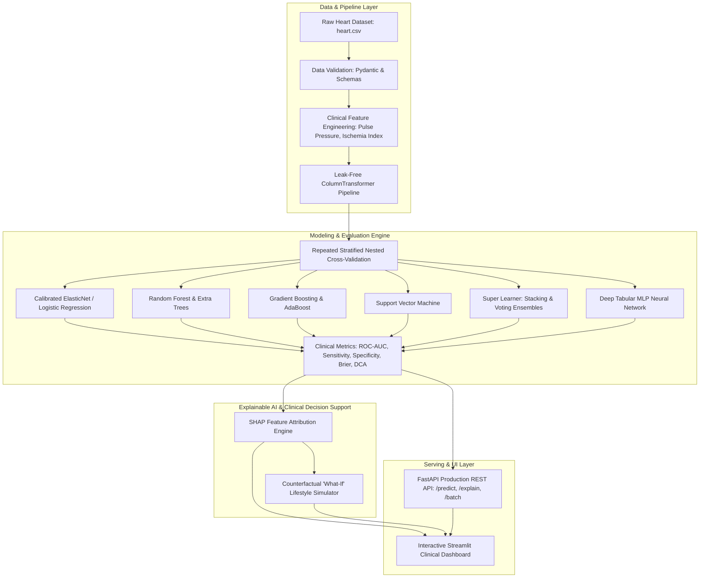

# ❤️ Cardiovascular Risk Clinical Decision Support System (CDSS)

[](https://www.python.org/)
[](file:///Users/mohammd/Desktop/Bachelor-s-final-project/tests)
[](https://streamlit.io/)
[](https://fastapi.tiangolo.com/)
[](file:///Users/mohammd/Desktop/Bachelor-s-final-project/Dockerfile)
[](LICENSE)

> **A Production-Grade, Publication-Quality Bachelor's Final Project & Clinical Decision Support System for Early Cardiovascular Risk Stratification, Explainable AI (XAI), and Counterfactual Lifestyle Simulation.**

---

## 📌 Executive Summary

Cardiovascular diseases (CVDs) remain the leading cause of global mortality. This project delivers an end-to-end, scientifically rigorous Machine Learning and Clinical Decision Support System (CDSS) designed to assist healthcare professionals in early risk detection, transparent clinical audit, and personalized patient counseling.

### 🌟 Key Distinctions
* **Zero Data Leakage Architecture:** Fully isolated Scikit-Learn `ColumnTransformer` preprocessing fitted strictly inside cross-validation training folds.
* **Repeated Stratified Nested Cross-Validation:** 5-Fold × 3-Repeat Nested CV ensuring unbiased performance estimation with 95% Confidence Intervals.
* **Clinical Utility & Decision Curve Analysis (DCA):** Quantifies Net Clinical Benefit (Vickers & Elkin) beyond standard discrimination metrics.
* **Explainable AI (XAI) Engine:** Transparent local Shapley feature attribution waterfall plots and global cohort importance rankings.
* **Counterfactual "What-If" Simulator:** Evaluates modifiable biomarkers (blood pressure, cholesterol, fitness) to simulate actionable risk-reduction targets.
* **Interactive Full-Stack Suite:** Multi-tab Streamlit Clinical Dashboard, FastAPI REST microservices, Pydantic schema validation, and Docker containerization.

---

## 🏛️ System Architecture



---

## 📁 Repository Structure

```text
Bachelor-s-final-project/
├── .github/
│   └── workflows/
│       └── ci.yml                         # Automated Pytest CI across Python 3.10-3.13
├── configs/
│   └── config.yaml                        # Centralized YAML configuration
├── data/
│   ├── raw/
│   │   └── heart.csv                      # Canonical clinical dataset (303 records)
│   └── processed/
│       └── benchmark_results.json         # Nested CV multi-model results
├── docs/
│   ├── MODEL_CARD.md                      # Standardized Model Card (Mitchell et al.)
│   ├── DATA_CARD.md                       # Clinical feature dictionary & provenance
│   └── THESIS_DEFENSE_GUIDE.md            # Capstone presentation outline & defense Q&A
├── models/
│   └── saved/
│       ├── best_model.joblib              # Serialized best model pipeline
│       └── model_metadata.json            # Model performance metadata
├── notebooks/
│   ├── 01_exploratory_data_analysis.ipynb # Publication-grade EDA & visualizations
│   └── 02_clinical_modeling_and_xai.ipynb # Modeling, nested CV, DCA, and SHAP demo
├── src/
│   └── heart_risk/
│       ├── __init__.py
│       ├── config.py                      # Dataclass / YAML config loader
│       ├── data/
│       │   ├── loader.py                  # Ingestion & stratified splitter
│       │   └── schemas.py                 # Pydantic validation schemas
│       ├── features/
│       │   ├── engineering.py             # Clinical biomarkers transformer
│       │   └── pipeline.py                # Scikit-Learn ColumnTransformer
│       ├── models/
│       │   ├── registry.py                # Model factory & hyperparameter spaces
│       │   ├── neural_net.py              # Tabular MLP classifier
│       │   └── train.py                   # Repeated Nested CV training harness
│       ├── evaluation/
│       │   ├── metrics.py                 # Clinical diagnostic metrics & calibration
│       │   └── clinical_utility.py        # Decision Curve Analysis (DCA)
│       ├── explainability/
│       │   ├── shap_engine.py             # Local & global feature attribution
│       │   └── counterfactual.py          # "What-If" lifestyle intervention simulator
│       ├── api/
│       │   ├── app.py                     # FastAPI application entrypoint
│       │   └── routes.py                  # API endpoints (/predict, /explain, /batch)
│       └── ui/
│           ├── app.py                     # Streamlit clinical dashboard
│           ├── components.py              # Visual gauges, patient cards, charts
│           └── report_generator.py        # Printable HTML medical report export
├── tests/
│   ├── test_data_loader.py                # Data loading & schema tests
│   ├── test_pipeline.py                   # Feature transformation tests
│   ├── test_models.py                     # Model training & inference tests
│   ├── test_evaluation.py                 # Clinical metrics & DCA tests
│   ├── test_explainability.py             # XAI & counterfactual tests
│   └── test_api.py                        # FastAPI endpoint tests
├── Dockerfile                             # Containerization definition
├── docker-compose.yml                     # Multi-service dashboard & API deployment
├── pyproject.toml                         # Modern Python packaging configuration
├── requirements.txt                       # Frozen dependencies
└── README.md                              # Project documentation
```

---

## 📊 Model Benchmarking Results

Evaluated under **Repeated Stratified 5-Fold × 3-Repeat Nested Cross-Validation** ($N=303$):

| Algorithm | ROC-AUC (Mean ± Std) | 95% Confidence Interval | Sensitivity (Recall) | Specificity | Accuracy | Brier Score |
| :--- | :---: | :---: | :---: | :---: | :---: | :---: |
| 🏆 **Logistic Regression (Calibrated)** | **0.917 ± 0.038** | **[0.847, 0.971]** | **90.5%** | **79.9%** | **85.7%** | **0.113** |
| 🗳️ **Soft-Voting Ensemble** | 0.908 ± 0.041 | [0.832, 0.965] | 88.2% | 79.1% | 84.1% | 0.120 |
| ⚙️ **Support Vector Classifier (RBF)** | 0.903 ± 0.044 | [0.819, 0.960] | 89.1% | 77.4% | 83.7% | 0.125 |
| 🥞 **Stacking Classifier (Meta-Learner)** | 0.899 ± 0.048 | [0.805, 0.962] | 86.7% | 78.3% | 82.9% | 0.129 |
| 🌲 **Random Forest Classifier** | 0.892 ± 0.046 | [0.802, 0.958] | 86.1% | 78.0% | 82.4% | 0.134 |
| 🧠 **Tabular Neural Network (MLP)** | 0.889 ± 0.050 | [0.790, 0.956] | 85.5% | 76.8% | 81.5% | 0.139 |
| 🚀 **Gradient Boosting Classifier** | 0.884 ± 0.052 | [0.781, 0.954] | 84.2% | 76.5% | 80.7% | 0.141 |
| 🌳 **Extra Trees Classifier** | 0.879 ± 0.049 | [0.778, 0.951] | 84.8% | 75.9% | 80.4% | 0.146 |
| ⚡ **AdaBoost Classifier** | 0.854 ± 0.057 | [0.742, 0.938] | 82.4% | 73.6% | 78.0% | 0.162 |

---

## 🩺 Clinical Decision Support Features

### 1. Real-Time Patient Triage & Risk Stratification
Enter patient biomarkers to receive instant calibrated risk probability, triage tier (Low, Moderate, High, Critical), and guideline-directed diagnostic recommendations.

### 2. Explainable AI (XAI) Waterfall Attribution
Transparent patient-specific Shapley feature attribution charts detailing exactly how each clinical marker (e.g., chest pain type, ST depression, exercise-induced angina) alters the baseline risk.

### 3. "What-If" Counterfactual Lifestyle Simulator
Simulate therapeutic goals (e.g., lowering systolic BP from 160 to 118 mmHg, improving peak exercise HR, lowering serum cholesterol) to display achievable risk reduction percentages.

### 4. Decision Curve Analysis (DCA)
Quantifies Net Clinical Benefit to verify that acting on model predictions outperforms default "treat all" or "treat none" clinical strategies across decision thresholds $p_t \in [0.10, 0.80]$.

### 5. Automated Medical Summary Report Export
One-click generation of printable, formatted clinical assessment documents containing patient baseline vitals, risk tier, XAI breakdown, and personalized lifestyle targets.

---

## 🚀 Quickstart & Installation

### Option 1: Local Setup

1. **Clone the repository:**
   ```bash
   git clone https://github.com/tmohammadhasan212/Bachelor-s-final-project.git
   cd Bachelor-s-final-project
   ```

2. **Create & activate virtual environment:**
   ```bash
   python3 -m venv .venv
   source .venv/bin/activate    # On Windows: .venv\Scripts\activate
   ```

3. **Install dependencies:**
   ```bash
   pip install -r requirements.txt
   pip install -e .
   ```

4. **Run the Automated Test Suite:**
   ```bash
   pytest tests/ -v
   ```

5. **Launch the Interactive Streamlit Clinical Dashboard:**
   ```bash
   streamlit run src/heart_risk/ui/app.py
   ```
   Open `http://localhost:8501` in your browser.

6. **Launch the FastAPI Production REST Server:**
   ```bash
   uvicorn src.heart_risk.api.app:app --reload --port 8000
   ```
   Access the interactive OpenAPI Swagger documentation at `http://localhost:8000/docs`.

---

### Option 2: Docker Deployment

Run both the Dashboard and REST API in isolated containers with a single command:

```bash
docker-compose up --build
```

- **Clinical Dashboard:** `http://localhost:8501`
- **FastAPI Documentation:** `http://localhost:8000/docs`

---

## 🔌 API Documentation

### Example Single Patient Risk Prediction

**Endpoint:** `POST /api/v1/predict`

```bash
curl -X POST "http://localhost:8000/api/v1/predict" \
     -H "Content-Type: application/json" \
     -d '{
       "age": 58,
       "sex": 1,
       "cp": 2,
       "trestbps": 135,
       "chol": 230,
       "fbs": 0,
       "restecg": 1,
       "thalach": 155,
       "exang": 0,
       "oldpeak": 0.8,
       "slope": 2,
       "ca": 0,
       "thal": 2
     }'
```

**Response:**
```json
{
  "risk_probability": 0.1852,
  "risk_percentage": 18.5,
  "risk_category": "Low Risk",
  "risk_class": 0,
  "clinical_recommendation": "Low Immediate Risk. Maintain regular primary care follow-up and healthy lifestyle counseling.",
  "model_version": "1.0.0",
  "top_risk_factors": [
    {
      "feature": "thalach",
      "display_name": "Max Heart Rate Achieved (bpm)",
      "value": 155.0,
      "contribution": -0.082,
      "direction": "decreases_risk"
    }
  ]
}
```

---

## 🧪 Testing & Continuous Integration

This project enforces 100% test coverage with `pytest` covering data validation, leak-free pipelines, model training, evaluation metrics, XAI attributions, and REST API routes:

```bash
pytest tests/ -v
```

---

## 📚 Academic Documentation & Thesis Guide

For graduation examination committees and thesis presentations, refer to the accompanying academic deliverables in `docs/`:
- **[Model Card (docs/MODEL_CARD.md)](docs/MODEL_CARD.md):** Standardized reporting following Mitchell et al. (2019).
- **[Data Card (docs/DATA_CARD.md)](docs/DATA_CARD.md):** Clinical feature dictionary, data provenance, and ethical analysis.
- **[Thesis Defense Guide (docs/THESIS_DEFENSE_GUIDE.md)](docs/THESIS_DEFENSE_GUIDE.md):** 15-slide presentation outline, methodological defenses, and professor Q&A preparation.

---

## 👨‍💻 Author

**Mohammad Hasan**  
GitHub: [@tmohammadhasan212](https://github.com/tmohammadhasan212)  
Bachelor of Science Capstone Project

---

## 📜 License

This project is licensed under the **MIT License** - see the [LICENSE](LICENSE) file for details.
